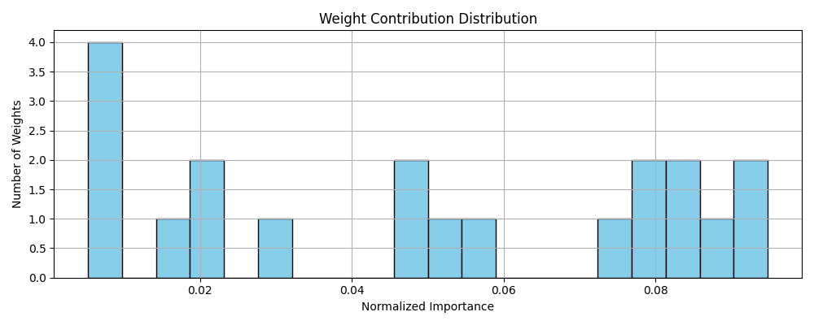
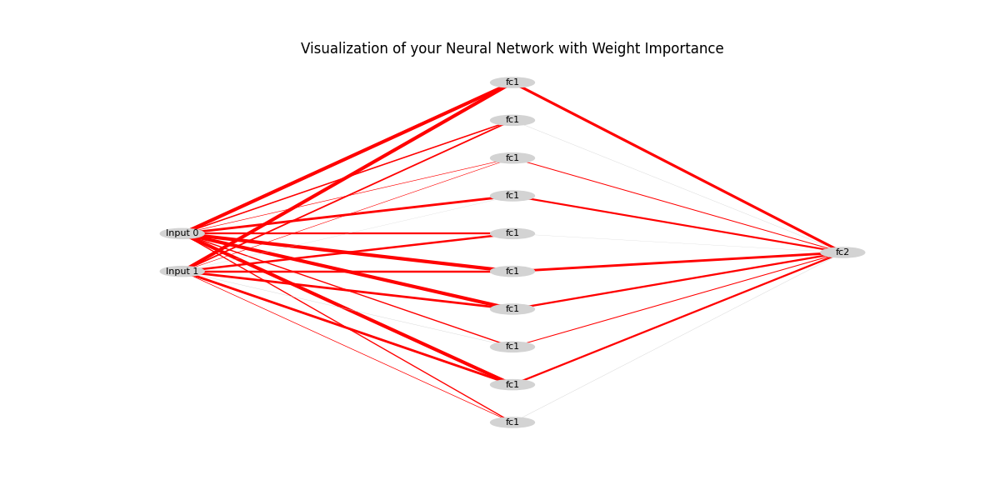
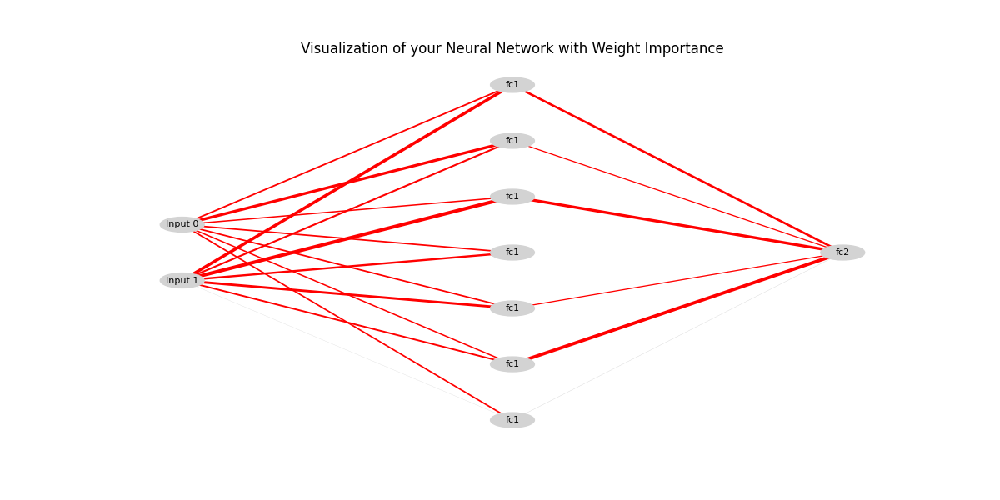

# Use Case: Optimizing a PyTorch Model

This tutorial demonstrates how to use `WeightUsageAnalyzer` to identify an oversized model and validate the benefits of a simpler one, based on objective metrics.

---

## Scenario

We have a simple binary classification task. We will first build an intentionally overly complex model, analyze it, then propose a more lightweight model and compare their performance and efficiency.

---

## Step 1: Analyzing the Oversized Model

We'll create an MLP with a hidden layer of 10 neurons, which is likely excessive for our 2-dimensional problem.

#### Code

```python
import torch
import torch.nn as nn
import numpy as np
import core.weightusageanalyzer as wua

# Dataset
X_np = np.random.rand(1000, 2).astype(np.float32)
y_np = ((X_np[:, 0] + X_np[:, 1]) > 1).astype(np.float32)
X = torch.from_numpy(X_np)

# "Too big" model
class BigMLP(nn.Module):
    def __init__(self):
        super().__init__()
        self.fc1 = nn.Linear(2, 10) # 10 neurons
        self.relu = nn.ReLU()
        self.fc2 = nn.Linear(10, 1)
        self.sigmoid = nn.Sigmoid()
    def forward(self, x):
        return self.sigmoid(self.fc2(self.relu(self.fc1(x))))

model = BigMLP()
# ... (Code for training the model for 50 epochs) ...

# Analysis
wua.print_flops_report(model, nb_epochs=50, dataset=X_np)
importance_list = wua.compute_weight_importance(model, X)
importance, weights, name = importance_list[0] # Analyze the fc1 layer
report, norm_imp = wua.generate_report(importance, weights)

print(f"\n📌 Report for layer: {name}")
wua.print_report(report)
wua.plot_importance_histogram(norm_imp, report['entropy'])
wua.show(model, X)
```

### Interpreting the Results
1. FLOPs Report: We first note the computational cost:
```bash
🧮 FLOPs Estimation:
 - Training (50 epochs, 1000 samples): 12,200,000 operations
 - Inference (1000 samples): 122,000 operations
```
2. Accuracy: The accuracy of this model is 0.8850

3. Weight Usage Report: The report for the fc1 layer look like this:
```bash
📊 Weight Usage Report:
Total number of weights: 20.0
Number of nodes (neurons): 10.0
Entropy (measure of uncertainty): 2.7584
Effective weights (active weights count): 15.7751
Contribution of top 90% of weights: 65.00%
Percentage of low weights (<1e-2): 0.00%
```

The entropy is relatively low and the number of effective weights (15.7751) is less than the total number of weights in the layer (20, from input->hidden). This suggests that not all neurons are being used optimally.

4. Histogram:


5. Visualization:


## Step 2: Analyzing the Simplified Model
Based on these observations, we reduce the hidden layer from 10 to 7 neurons.

```python

# Simple model
class SimpleMLP(nn.Module):
    def __init__(self):
        super().__init__()
        self.fc1 = nn.Linear(2, 7) # 7 neurons
        # ... rest of the model ...

# ... (identical training and analysis) ...
```

### Interpreting the New Results
1. FLOPs Report: The cost has decreased.

``` bash
🧮 FLOPs Estimation:
 - Training (60 epochs, 1000 samples): 10,320,000 operations
 - Inference (1000 samples): 86,000 operations
```
Despite more epochs, the training is less expensive, and inference is 1.4x faster.

2. Accuracy: the model's accuracy is as high as the inital model(87.30%), confirming that the removed neurons were indeed redundant.

3. Visualization:


## Conclusion
We objectively demonstrated that the initial model was oversized. By reducing its size, we achieved a model that is:
- As accurate as the original.
- Faster at inference 
- Less costly to train.
- More interpretable, as most of its components are now significant.

